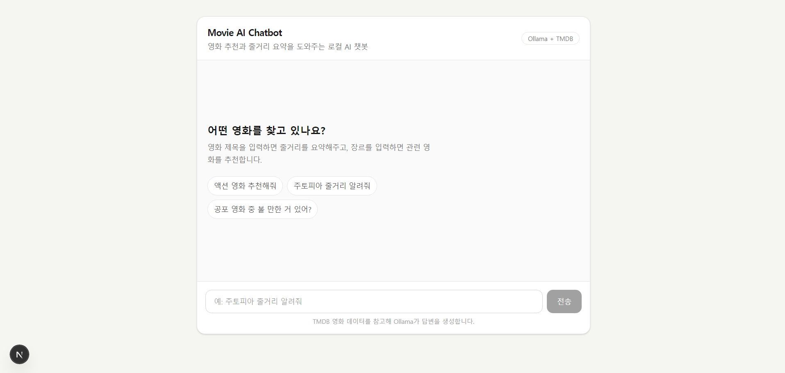
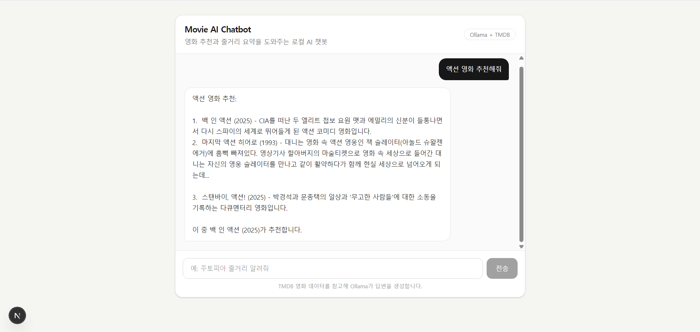

# Movie AI Chatbot

TMDB 영화 데이터를 검색하고 Ollama 로컬 LLM을 활용해 영화 줄거리 요약 및 영화 추천 기능을 제공하는 AI 챗봇입니다.

프론트엔드는 Next.js와 TypeScript로 구현하였고, 백엔드는 PHP로 구성했습니다. Docker Compose를 사용하여 PHP 서버와 Ollama 서버를 함께 실행할 수 있도록 구성했습니다.

## 주요 기능

* 영화 제목 기반 줄거리 요약
* 장르 기반 영화 추천
* TMDB API를 활용한 영화 정보 실시간 검색
* Ollama 로컬 LLM을 활용한 답변 생성
* 채팅 형태의 사용자 인터페이스
* Next.js API Route를 통한 프론트엔드/백엔드 연결

## 기술 스택

### Frontend

* Next.js
* React
* TypeScript
* Tailwind CSS

### Backend

* PHP
* Docker
* Docker Compose
* Ollama
* TMDB API

## 실행 방법

### 1. 환경 변수 설정

프로젝트 최상위에 `.env` 파일을 생성하고 TMDB API Key를 입력합니다.

```env
TMDB_API_KEY=your_tmdb_api_key_here
```

### 2. Docker 컨테이너 실행

```bash
docker compose up -d
```

### 3. Ollama 모델 다운로드

최초 1회만 실행합니다.

```bash
docker exec -it movie-ollama ollama pull llama3.2
```

### 4. 프론트엔드 실행

```bash
cd frontend
npm install
npm run dev
```

브라우저에서 접속합니다.

```text
http://localhost:3000
```

## 사용 예시

```text
주토피아 줄거리 알려줘
```

```text
액션 영화 추천해줘
```

```text
공포 영화 중 볼 만한 거 있어?
```

## 실행 화면


